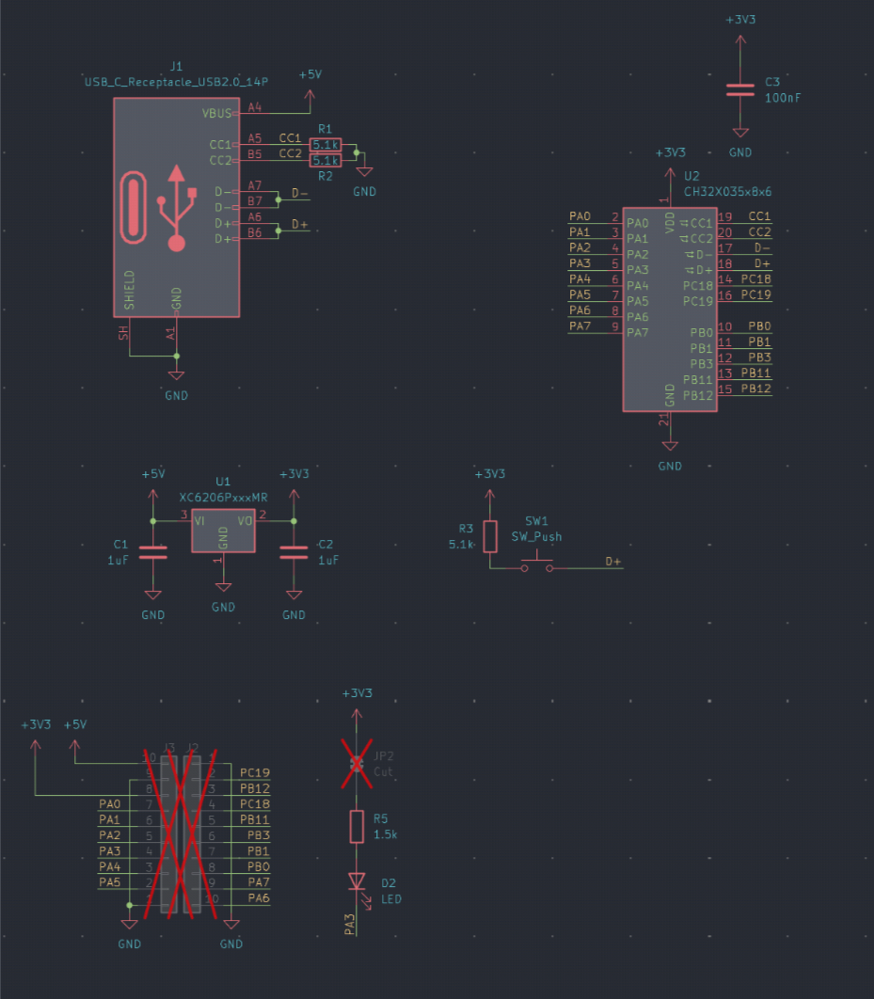
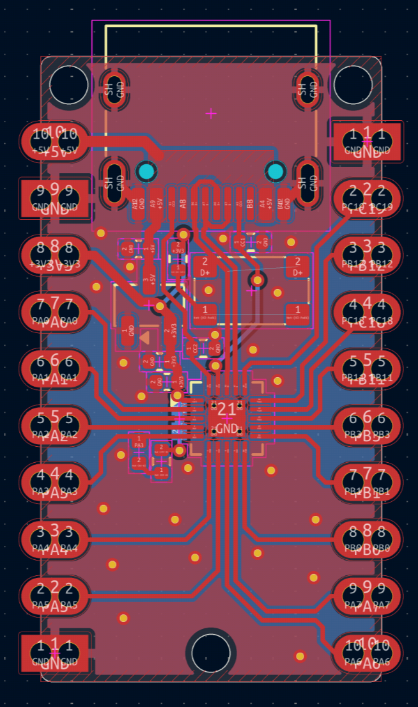
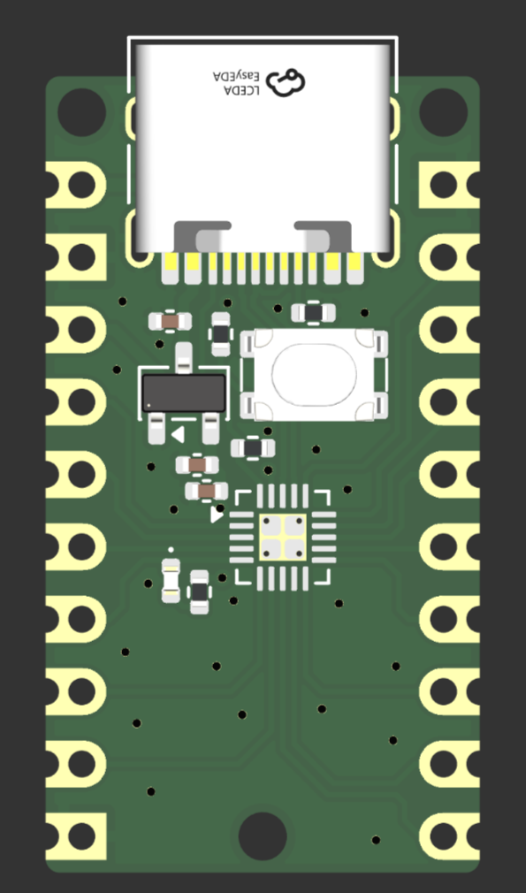

# x35 devboard

Why? IDFK blame max. I am in their basement help. ch32x350 devboard w/ usb pd and 24v tolerance u can use this to negotate pd or whatever it uses a mcu just do mcu things brrrrrrr

Features:
- Tiny footprint
- Tiny footprint *2
- usb pd
- usb bootloader so no max in a basement :c 
- i'm going crazy 

3d pic too

heres a virtual bom that's useless

| item | price|
| --|--|
|pcb pcba | $70| 
